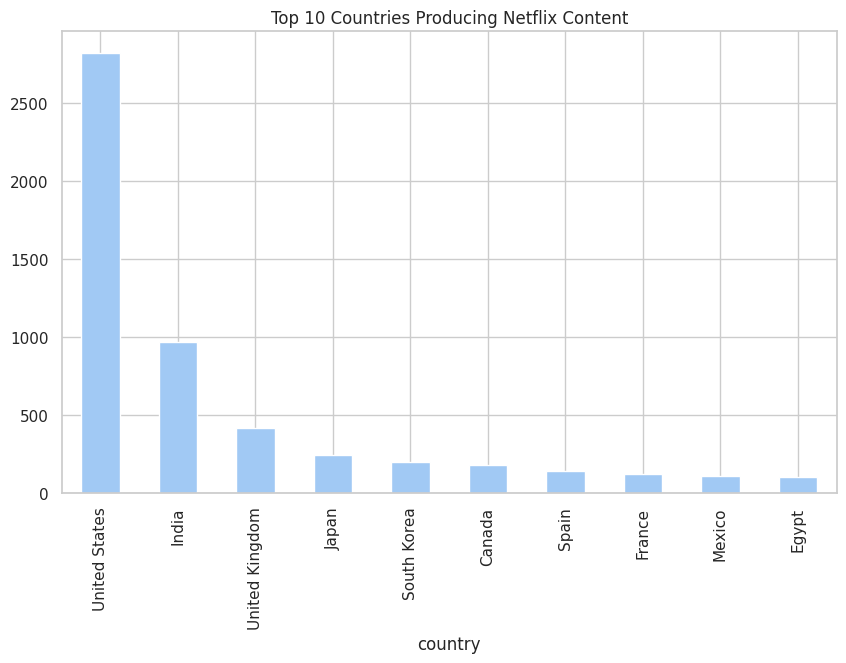

# 🎬 Netflix Visualization Project


## Overview
This project explores the **Netflix Titles** dataset from Kaggle and presents a set of attractive, informative visualizations created with **Seaborn** and **Matplotlib**.  
The goal is to analyze the composition and trends in Netflix's catalogue — content types, release-year trends, ratings, country production, and genre popularity — then surface concise insights you can act on.

---

## 📁 Repository Structure
```
Netflix-Visualization-Project/
├─ netflix_titles.csv
├─ Mini_Task_3.ipynb          # Jupyter Notebook (Google Colab friendly)
├─ README.md                  # This file
└─ images/
   ├─ Content_Added_to_Netflix_Over_the_Years.png
   ├─ Distribution_of_Ratings_on_Netflix.png
   ├─ Top_10_Countries_Producing_Netflix_Content.png
   └─ Top_10_Genres_on_Netflix.png
```

---

## 🗂 Dataset (Short Description)
**Name:** Netflix Movies and TV Shows  
**Source:** Kaggle — `netflix_titles.csv`  
**Key columns:**
- `type` — Movie or TV Show  
- `title` — Title of the show/movie  
- `director` — Director(s)  
- `cast` — Main cast  
- `country` — Country of production  
- `date_added` — Date the title was added to Netflix  
- `release_year` — Year the title was released  
- `rating` — Content rating (PG-13, TV-MA, etc.)  
- `duration` — Minutes (for movies) or number of seasons (for TV shows)  
- `listed_in` — Genres / categories

---

## 🧰 How to run (Google Colab)
1. Open [Google Colab](https://colab.research.google.com/) and upload `Mini_Task_3.ipynb` or create a new notebook.  
2. Upload `netflix_titles.csv` to the Colab session (or mount Google Drive).  
3. Install required packages (if necessary) and run the notebook cells:

```bash
!pip install pandas seaborn matplotlib
```

4. Run each cell top-to-bottom. Save plots with `plt.savefig("images/your_plot.png")` if you want local images.

---

## 📊 Visualizations & Screenshots

### 1) Content Added to Netflix Over the Years  
  
**What it shows:** Yearly counts of titles added, stacked by content `type` (Movie vs TV Show).  
**Quick takeaway:** Noticeable acceleration in content additions after 2010, with TV Shows growing faster in recent years.

---

### 2) Distribution of Ratings on Netflix  
  
**What it shows:** Counts of titles grouped by content rating (e.g., TV-MA, PG-13).  
**Quick takeaway:** A large share of content is targeted to mature audiences (TV-MA), reflecting Netflix’s emphasis on adult-oriented and diverse programming.

---

### 3) Top 10 Countries Producing Netflix Content  
  
**What it shows:** Which countries appear most often in the `country` column.  
**Quick takeaway:** The United States leads production volume, followed by other major producers (country tallies may include multiple countries per title).

---

### 4) Top 10 Genres on Netflix  
  
**What it shows:** The most common genres/categories after splitting and counting multi-genre entries.  
**Quick takeaway:** Common categories include International Dramas, Comedies, Documentaries, and Stand-up Comedy — indicating variety and strong non-US content presence.

---

## 📝 Key Insights (Summary)
- **Rapid catalog growth since 2010**, driven by strong investments in original and licensed content.  
- **TV Shows are growing faster** than Movies — consistent with the streaming-era focus on serial content to retain subscribers.  
- **Mature-rated content** (e.g., TV-MA) constitutes a large portion of the catalog, suggesting Netflix targets an adult demographic with a lot of original programming.  
- **Genre diversity** is high — Netflix maintains a wide catalogue across drama, comedy, documentary, and international content to appeal to global audiences.  
- **Country of production** is dominated by a few countries (notably the U.S.), but the presence of many other countries highlights Netflix’s growing international footprint.

---

## 🔁 Reproduce these results locally or on Colab
1. Load the CSV:
```python
import pandas as pd
df = pd.read_csv("netflix_titles.csv")
```
2. Quick cleaning tips:
```python
df['listed_in'] = df['listed_in'].fillna('')
df['country'] = df['country'].fillna('Unknown')
df['date_added'] = pd.to_datetime(df['date_added'], errors='coerce')
```
3. Examples of generating & saving a plot:
```python
import seaborn as sns
import matplotlib.pyplot as plt

genres = df['listed_in'].dropna().str.split(',').explode().str.strip()
top_genres = genres.value_counts().head(10)

plt.figure(figsize=(10,6))
sns.barplot(x=top_genres.values, y=top_genres.index)
plt.title("Top 10 Genres on Netflix")
plt.xlabel("Number of Titles")
plt.tight_layout()
plt.savefig("images/Top_10_Genres_on_Netflix.png", dpi=200)
plt.show()
```

---

## 📤 How to push to GitHub
From a local repo root (replace `<remote-url>` with your GitHub repo URL):
```bash
git init
git add .
git commit -m "Add Netflix visualization project"
git branch -M main
git remote add origin <remote-url>
git push -u origin main
```
> If your notebook or images are large, consider using Git LFS for media files.

---

## 📎 Notes & Caveats
- `country` and `listed_in` fields contain comma-separated values; splitting and exploding them is important for per-genre or per-country counts.  
- `date_added` may contain inconsistent formats — use `errors='coerce'` in `pd.to_datetime` and verify missing dates.  
- Ratings and countries may be multi-valued; clean accordingly based on the analysis goal.

---

## 🧾 License & Credits
Dataset: Kaggle - *Netflix Movies and TV Shows*  
Created by: **Your Name** (replace this with your name)  
License: Check the original Kaggle dataset page for license details.

---

## ✨ Contact
Have suggestions or want more plots? Open an issue or contact me at: `your-email@example.com` (replace with your email)

---

> _Generated: Netflix Visualization Project README — includes screenshots in `images/` that are expected to be in the same repo so GitHub renders them in the file preview._
