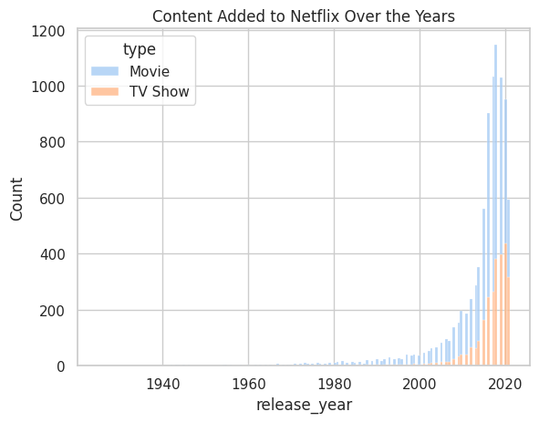
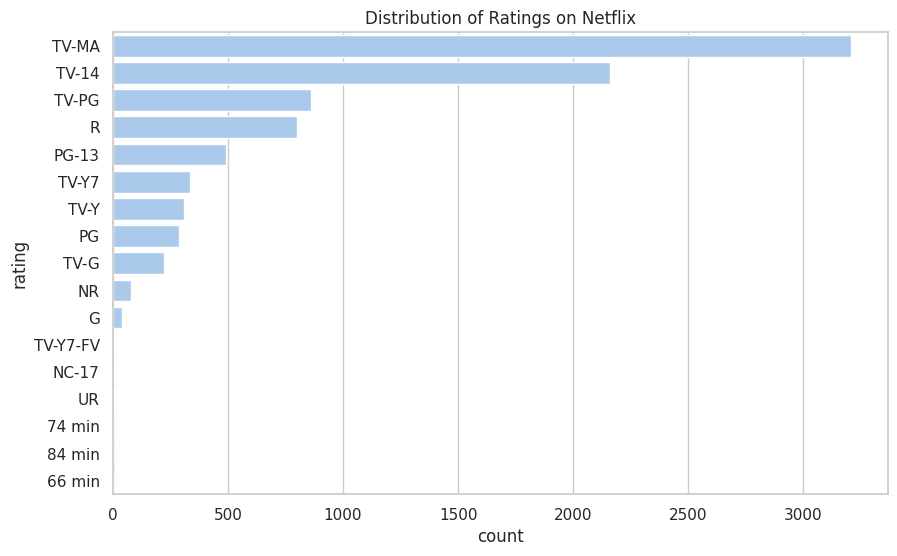
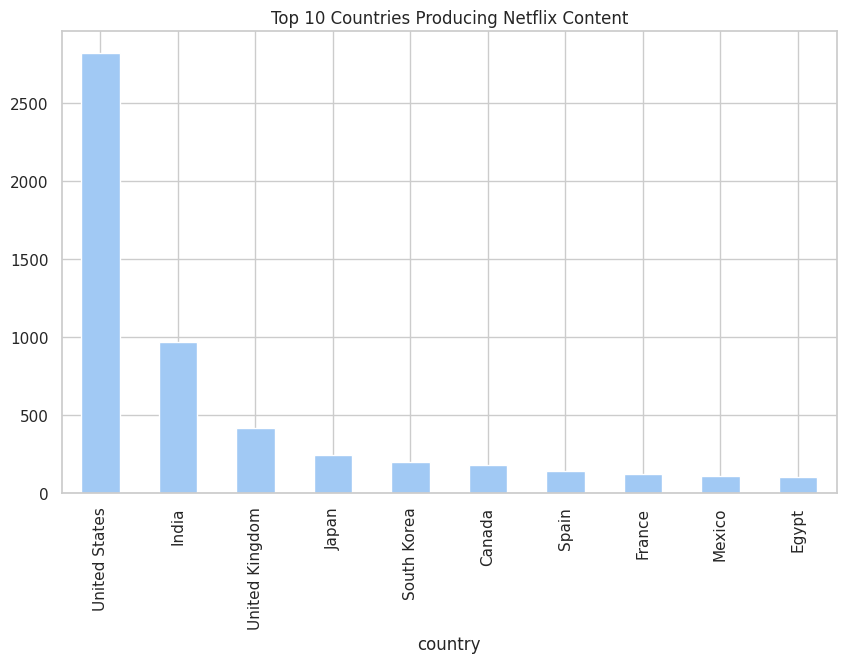
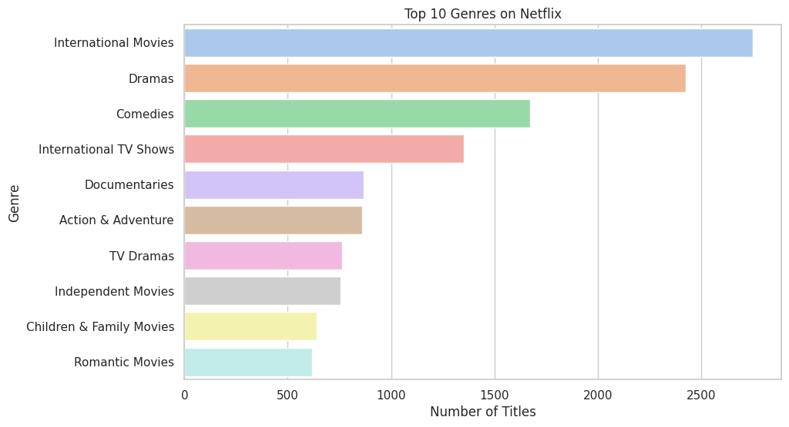

# 🎬 Netflix Content Visualization Project

## Dataset

This project uses the [Netflix Movies and TV Shows
Dataset](https://www.kaggle.com/datasets/shivamb/netflix-shows) from
Kaggle.\
The dataset contains metadata about titles available on Netflix,
including:

-   **Type**: Movie or TV Show\
-   **Title**: Name of the content\
-   **Director & Cast**: People involved in production\
-   **Country**: Country of origin\
-   **Release Year**: Year the content was released\
-   **Rating**: TV rating (e.g., TV-MA, PG-13)\
-   **Duration**: Length in minutes or number of seasons\
-   **Listed In**: Genres/categories of the content

------------------------------------------------------------------------

## Visualizations

### 1. Content Added to Netflix Over the Years

Netflix's library has expanded rapidly since 2010, with a sharp increase
in content production after 2015.\
This reflects Netflix's global expansion and investment in original
productions.

------------------------------------------------------------------------

### 2. Distribution of Ratings on Netflix

The majority of Netflix content is rated **TV-MA** (Mature Audience).\
This indicates a significant focus on adult-oriented content, while
family-friendly options like TV-Y or PG are relatively fewer.

------------------------------------------------------------------------

### 3. Top 10 Countries Producing Netflix Content

The **USA** leads by a wide margin in Netflix content production,
followed by **India** and the **UK**.\
This highlights Netflix's strong presence in Hollywood and Bollywood, as
well as partnerships with UK studios.

------------------------------------------------------------------------

### 4. Top 10 Genres on Netflix

Popular genres include **Documentaries, Stand-Up Comedy, Dramas, and
International TV Shows**.\
This reflects Netflix's diverse catalog, catering to a wide range of
audiences globally.

------------------------------------------------------------------------

## Key Insights

-   Netflix hosts **more movies than TV shows**, but TV shows have grown
    steadily in recent years.\
-   The platform has **rapidly expanded after 2010**, especially
    post-2015.\
-   **TV-MA (mature audience)** is the most common rating, suggesting a
    focus on adult-oriented content.\
-   **USA, India, and the UK** dominate Netflix content production.\
-   **Documentaries and stand-up comedy** are among the most represented
    genres, alongside traditional drama and international TV.

------------------------------------------------------------------------

## 📂 Project Structure

    📂 mini-task-3
     ┣ 📄 netflix_titles.csv          # Dataset
     ┣ 📄 Mini_Task_3.ipynb           # Jupyter Notebook with code
     ┣ 📂 images/                     # Visualization outputs
     ┃ ┣ Content_Added_to_Netflix_Over_the_Years.png
     ┃ ┣ Distribution_of_Ratings_on_Netflix.png
     ┃ ┣ Top_10_Countries_Producing_Netflix_Content.png
     ┃ ┗ Top_10_Genres_on_Netflix.png
     ┗ 📄 README.md                   # Project documentation

------------------------------------------------------------------------

Created with **Python, Pandas, Seaborn, and Matplotlib**
